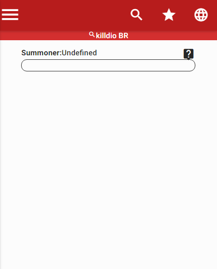
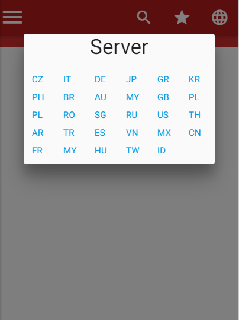
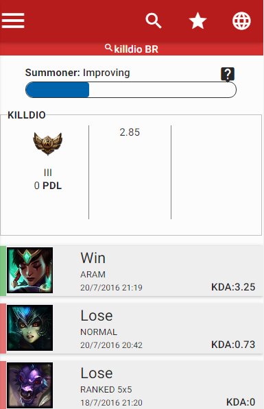
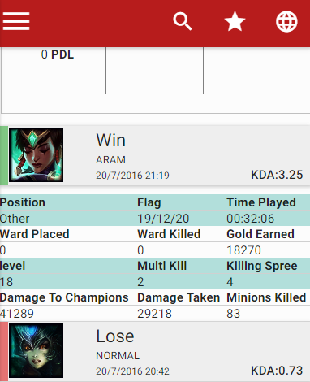
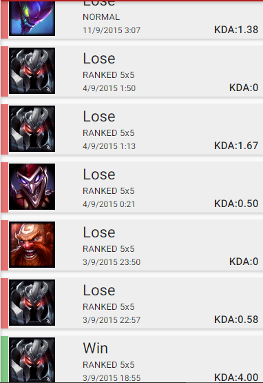
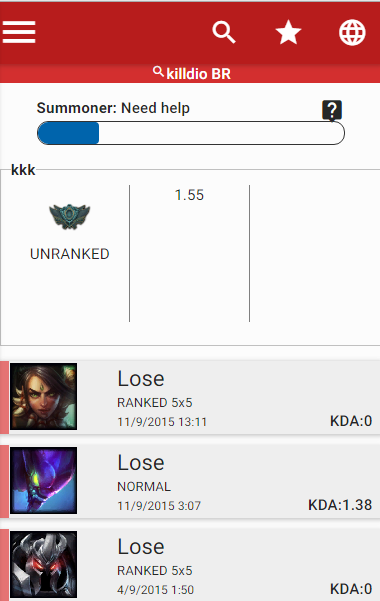
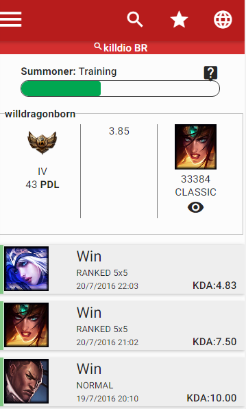
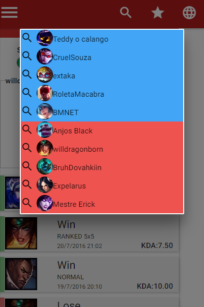

<html>
  <head>
    <meta charset="utf-8">
  </head>
  <body>
      <table style="width:100%;  border: 1px solid black; border-collapse: collapse;">
        <tr>
          <th colspan="2">Home screen</th>
        </tr>
        <tr>
          <td>  </td>
          <td >This is the first screen.</td>
        </tr>
        <tr>
          <th colspan="2">Select your server</th>
        </tr>
        <tr>
          <td>  </td>
          <td > Across the globe button is selected the server .</td>
        </tr>
        <tr>
		<th colspan="2">Search the summoner</th>
        </tr>
        <tr>
          <td>  </td>
          <td > The magnifying glass button is held research.</td>
        </tr>
		<tr>
          <th colspan="2">Match details</th>
        </tr>
        <tr>
          <td>  </td>
          <td > By clicking on the line, match updates appears.</td>
        </tr>
	   <th colspan="2">More...</th>
        </tr>
        <tr>
          <td>  </td>
          <td > Only the last 10 matches will be shown .</td>
        </tr>
	   <th colspan="2">More...</th>
        </tr>
        <tr>
          <td>  </td>
          <td > With the display know this lane had needed help, I can avoid a snowball , rage and bad matches ...</td>
        </tr>
		
	   <th colspan="2">current game...</th>
        </tr>
        <tr>
          <td>  </td>
          <td > The current departure information will also be shown and this is considered in the evaluation</td>
        </tr>
		
	   <th colspan="2">members of current game...</th>
        </tr>
        <tr>
          <td>  </td>
          <td > by clicking the " eye " members of the teams will be displayed ... this time we conducted a control requests ... You can only search one every 10 seconds .</td>
        </tr>
		
		The goal of the app is to facilitate the analysis of the last matches of the members of the game. Avoiding snowball , making the most balanced matches .  
		
		Do not use ofencivos names only name that indicate whether help is very necessary.  
		
		I have 10 friends tested the app is the results are good ... it is possible to provide for a stomp, and prevent it from happening .  
		
    </table>
      
      
  </body>
</html>
