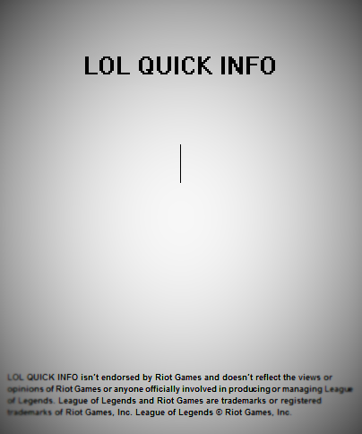

<html>
  <head>
    <meta charset="utf-8">
  </head>
  <body>
      
<h1>TITLE APP: LOL QUICK INFO<h1>

      
<h2>APP FOR ANDROID, IOS, WINDOWS PHONE<h2>

      

        <h2>
        Disclaimer
        </h2>
         
         <h3>
		LOL QUICK INFO isn’t endorsed by Riot Games and doesn’t reflect the views or opinions of Riot Games or anyone officially involved in producing or managing League of Legends. League of Legends and Riot Games are trademarks or registered trademarks of Riot Games, Inc. League of Legends © Riot Games, Inc.
	</h3>
      

      <table style="width:100%;  border: 1px solid black; border-collapse: collapse;">
        <tr>
          <th colspan="2">Home screen</th>
        </tr>
       	<tr>
          <td>  </td>
          <td >SPLASH SCREEN WITH Disclaimer.</td>
        </tr>
        <tr>
          <td>  </td>
          <td >This is the first screen.</td>
        </tr>
        <tr>
          <th colspan="2">Select your server</th>
        </tr>
        <tr>
          <td>  </td>
          <td > Across the globe button is selected the server .</td>
        </tr>
        <tr>
	   <th colspan="2">Search the summoner</th>
        </tr>
        <tr>
          <td>  </td>
          <td > The magnifying glass button is held research.</td>
        </tr>
		<tr>
          <th colspan="2">Match details</th>
        </tr>
        <tr>
          <td>  </td>
          <td > By clicking on the line, match updates appears.</td>
        </tr>
	   <th colspan="2">More...</th>
        </tr>
        <tr>
          <td>  </td>
          <td > Only the last 10 matches will be shown .</td>
        </tr>
	   <th colspan="2">More...</th>
        </tr>
        <tr>
          <td>  </td>
          <td > With the display know this lane had needed help, I can avoid a snowball , rage and bad matches ...</td>
        </tr>
	   <th colspan="2">current game...</th>
        </tr>
        <tr>
          <td>  </td>
          <td > The current departure information will also be shown and this is considered in the evaluation</td>
        </tr>
	   <th colspan="2">members of current game...</th>
        </tr>
        <tr>
          <td>  </td>
          <td> by clicking the " eye " members of the teams will be displayed ... this time we conducted a control requests ... You can only search one every 10 seconds .</td>
        </tr>
        <tr>
    	The goal of the app is to facilitate the analysis of the last matches of 
        the members of the game. Avoiding snowball , making the most balanced matches. 
	not use ofencivos names only name that indicate whether help is very necessary. 
	I have 10 friends tested the app is the results are good ... it is possible to 
	provide for a stomp, and prevent it from happening. 
	</tr>
  </body>
</html>
